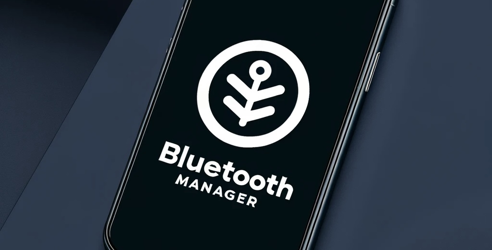
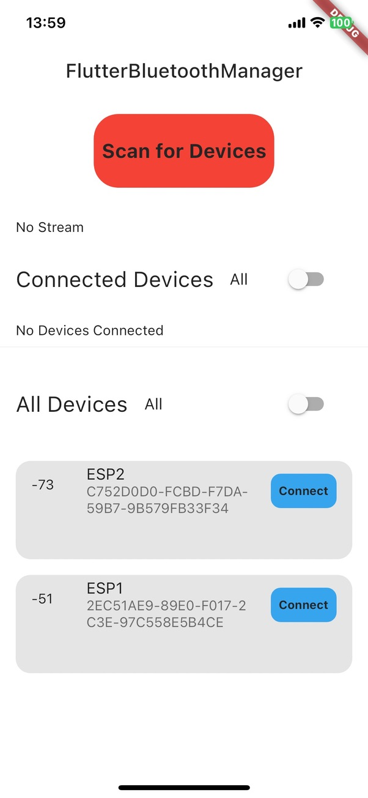
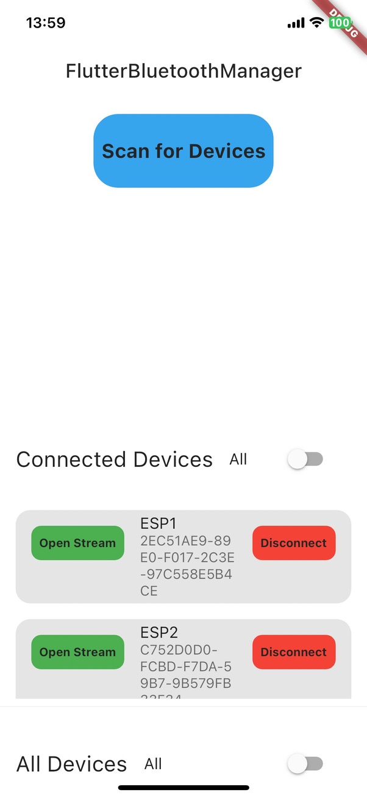
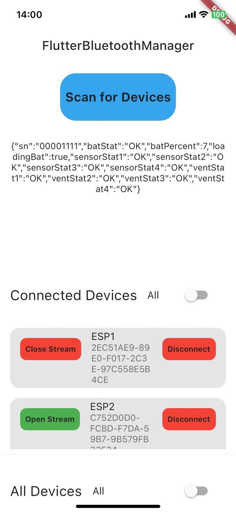
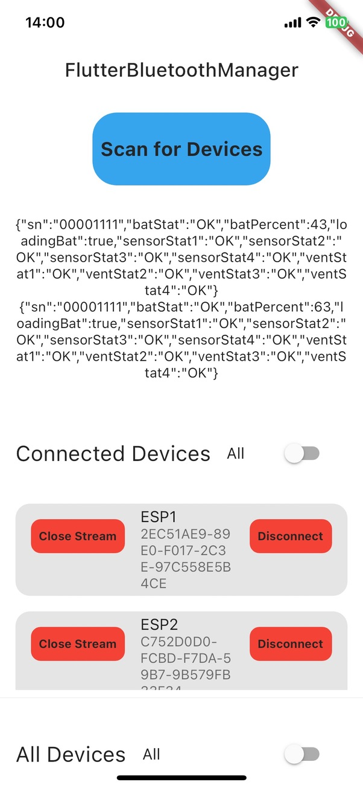

[](https://discord.gg/Yk5Efra)

<div align="center">
    
</div>


The aim of `FlutterBluetoothManager` is to handle multiple devices and their streams with ease. It is built on top of the Flutter Bluetooth Package `FlutterBluePlus`.

## BluetoothManager

The BluetoothManager creates a DeviceModel. This represents the device and it's corresponding Services and Characteristics. A device is unique to a DeviceModel. There can be multiple Services and Characteristics per DeviceModel.

The general Structure looks like this:
```dart
class DeviceModel {
  final BluetoothDevice device;
  final List<BluetoothService> services;
  final List<CharacteristicStream> characteristicsStream;
  DeviceModel(this.device, this.services, this.characteristicsStream);
}
```
CharacteristicStream contains the BluetoothCharacteristic and Info wether it's Stream is initialized.
```dart
class CharacteristicStream {
  final BluetoothCharacteristic characteristic;
  bool isInitialized;
  CharacteristicStream({
    required this.characteristic,
    this.isInitialized = false,
  });
}
```
## Features
Following pictures shows the example of the BluetoothManager.

<table>
  <tr>
    <td></td>
    <td></td>
    <td></td>
    <td></td>
  </tr>
</table>

## Getting Started

To get started you simply create an instance of the 
### BluetoothManager:
```dart
BluetoothManager bluetoothManager = BluetoothManager();
```
### Connect a device:
```dart
bluetoothManager.connectDevice(BluetoothDevice device);
```
### Disconnect a device:
```dart
bluetoothManager.disconnectDevice(BluetoothDevice device);
``````

### Check device ConnectionState:
A common problem is, if you accidently lose connection to a device it can lead to an exeption. With this function you constantly check the device connectionState for all connected devices and if it loses a connection the device will be disconnected and removed from the DeviceModel preventing exeptions or potential errors.

```dart
bluetoothManager.checkDeviceConnection();
```
### Get Characteristic:
To retrieve a Characteristic for subscribing to a stream or writing message you can perform this by calling `getCharacteristic`. Since there can be multiple Characteristics per Service you can choose it by Number.
```dart
bluetoothManager.getCharacteristic(BluetoothDevice device, int characteristicNumber);
```

### Open Stream
To receive a stream you need to call the `openStream` function. It takes a `characteristic` and returns/yields a `Stream<List<int>>`.
```dart
bluetoothManager.openStream(BluetoothCharacteristic? characteristic);
```
### StreamHandler
You can handle multiple streams by simply calling the streamHandler. It takes the device index value and a stream as input. You need to use the stream of `openStream`.
```dart
bluetoothManager.streamHandler(index, stream);
```

### Get Stream
Retrieve a stream for Streambuilder by its device index
```dart
bluetoothManager.getStream(index)
```

### Close a stream
```dart
bluetoothManager.closeStream(index)
```

## Additional information

Tested with IOS17.